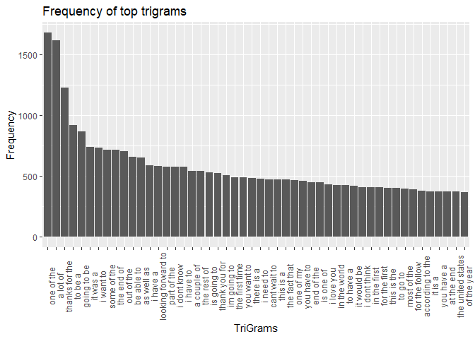

## Introduction

This is the Milestone report for Exploratory Data Analysis of the Data Science Capstone Project from John Hopkins University in Coursera. The goal of this project is to build an application based on predive text model. The User will give the input text and the model will predict the next word. The model is trained on the large corpus which contains twitter, news, blogs data.

## Load Data

Loading all the required packages

```r
library('tm')
```

```
## Warning: package 'tm' was built under R version 3.5.3
```

```r
library('SnowballC')
library('slam')
library('RWeka')
```

```
## Warning: package 'RWeka' was built under R version 3.5.3
```

```r
library(ggplot2)
library(tidytext)
```

```
## Warning: package 'tidytext' was built under R version 3.5.3
```

```r
library(dplyr)
library(tidyr)
```

Now loading the data

```r
#reading twitter data
con <- file("en_US.twitter.txt", 'r')
twitter <- readLines(con, encoding = "UTF-8", skipNul = TRUE)
close(con)


#reading news data
dir <- paste0("","")
con <- file(paste0(dir,"en_US.news.txt"), open = "rb")
news <- readLines(con, encoding = "UTF-8", skipNul = TRUE)
close(con)


#reading blogs data
con <- file("en_US.blogs.txt", 'r')
blogs <- readLines(con, encoding = "UTF-8", skipNul = TRUE)
close(con)
```

## Summary Statistics

Now that we have loaded all the data, we need to perform some statistics to get to know the data. Summary Statistics like no of character, no of lines, file sizes are calculated.

```r
summary <- data.frame('File' = c('twitter', 'news', 'blogs'),
                      'File size' = sapply(list(twitter, news, blogs),
                                           function(x){format(object.size(x), "MB")}),
                      'Lines' = sapply(list(twitter, news, blogs), function(x){length(x)}),
                      'chars' = sapply(list(twitter, news, blogs), function(x){sum(nchar(x))}))

summary
```

```
##      File File.size   Lines     chars
## 1 twitter    319 Mb 2360148 162096241
## 2    news  257.3 Mb 1010242 203223160
## 3   blogs  255.4 Mb  899288 206824505
```

## Data Cleaning and Sampling

First all the non-english characters were removed and we sample 1% of the data from each dataset.


```r
twitter <- iconv(twitter , "UTF-8", "ASCII", sub = "")
news <- iconv(news , "UTF-8", "ASCII", sub = "")
blogs <- iconv(blogs , "UTF-8", "ASCII", sub = "")

#sampling 5% of twitter data
set.seed(123)
lines.count <- length(twitter)
samples <- rbinom(lines.count, 1, 0.05)==1
twitter.sample <- twitter[samples]

#sampling 5% of news data
set.seed(123)
lines.count <- length(news)
samples <- rbinom(lines.count, 1, 0.05)==1
news.sample <- news[samples]

#sampling 5% of blogs data
set.seed(123)
lines.count <- length(blogs)
samples <- rbinom(lines.count, 1, 0.05)==1
blogs.sample <- blogs[samples]
```

Profanity filtering plays a main in Keyword prediction. i used Predefines Profane words dataset from http://www.bannedwordlist.com/lists/swearWords.txt .

```r
con <- file("ProfaneWords.txt" , 'r')
Profane.words <- readLines(con)
close(con)
```

concatenating all three files to one

```r
total.sample <- c(blogs.sample, news.sample, twitter.sample)
```

removing unnecessary variables which we never use again in futute as they consumes a large amount of RAM.

```r
remove(con)
remove(twitter)
remove(samples)
remove(blogs)
remove(news)
remove(dir)
remove(lines.count)
remove(blogs.sample)
remove(news.sample)
remove(twitter.sample)
# remove(doc.vec)
```

## Building the Corpus

Next we will build the corpus with the help of `tm`, `RWeka`, `SnowballC` packages. We convert the corpus to lower case, removed Punctuations, numbers, Profane words and stripped the white spaces left after removing them. Then we convert it to Plain text.


```r
doc.corpus <- VCorpus(VectorSource(total.sample))

doc.corpus <- tm_map(doc.corpus, tolower)
doc.corpus <- tm_map(doc.corpus, removeNumbers)
doc.corpus <- tm_map(doc.corpus, removePunctuation)
#doc.corpus <- tm_map(doc.corpus, removeWords, stopwords("english"))
doc.corpus <- tm_map(doc.corpus, removeWords, Profane.words)
#doc.corpus <- tm_map(doc.corpus, stemDocument, language = "english")
doc.corpus <- tm_map(doc.corpus, stripWhitespace)
doc.corpus <- tm_map(doc.corpus, PlainTextDocument)
```

Now we tokenize the sample and form Unigrams, Bigrams, Trigrams, Quadgrams. First we write the code for Functions.


```r
unigramTokenizer <- function(x) NGramTokenizer(x, Weka_control(min = 1, max = 1))
bigramTokenizer <- function(x) NGramTokenizer(x, Weka_control(min = 2, max = 2))
trigramTokenizer <- function(x) NGramTokenizer(x, Weka_control(min = 3, max = 3))
quadgramTokenizer <- function(x) NGramTokenizer(x, Weka_control(min = 4, max = 4))
```

Then we use these functions to form Term Document Matrices of the above 4 n-grams. 


```r
unigrams <- TermDocumentMatrix(doc.corpus, control = list(tokenize = unigramTokenizer))
bigrams <- TermDocumentMatrix(doc.corpus, control = list(tokenize = bigramTokenizer))
trigrams <- TermDocumentMatrix(doc.corpus, control = list(tokenize = trigramTokenizer))
quadgrams <- TermDocumentMatrix(doc.corpus, control = list(tokenize = quadgramTokenizer))

remove(doc.corpus)
```

we need to convert all the grams to DataFrames for further Processing. So, we used `tidytext` package to do this. It form a DataFrame which contains each word with the frequency in respective Documents. we sum all the counts of a word for each respective documents.


```r
df.uni <- tidy(unigrams)
df.uni <- summarise(group_by(df.uni, term), count = sum(count))
df.uni <- df.uni[order(-df.uni$count),]

df.bi <- tidy(bigrams)
df.bi <- summarise(group_by(df.bi, term), count = sum(count))
df.bi <- df.bi[order(-df.bi$count),]

df.tri <- tidy(trigrams)
df.tri <- summarise(group_by(df.tri, term), count = sum(count))
df.tri <- df.tri[order(-df.tri$count),]

df.quad <- tidy(quadgrams)
df.quad <- summarise(group_by(df.quad, term), count = sum(count))
df.quad <- df.quad[order(-df.quad$count),]
```

## Exploratory Data Analysis

We plot Barplots for the highest 50 frequent words and histograms of words for each gram dataframes.


```r
# Visualizing Unigrams
g <- ggplot(df.uni[1:50,],
            aes(x = reorder(term, -count), y  = count))
g <- g + geom_bar(stat = "identity")
g <- g + labs(x = "UniGrams", y = "Frequency",
              title = "Frequency of top unigrams")
g <- g + theme(axis.text.x = element_text(angle = 90))
g
```

<!-- -->

```r
qplot(log(count),
      data = df.uni,bins = 50,
      main = "Histogram of frequencies of Unigrams",
      xlab = "Frequency",
      ylab = "count")
```

<!-- -->

```r
# Visualizing Bigrams
g <- ggplot(df.bi[1:50,],
            aes(x = reorder(term, -count), y  = count))
g <- g + geom_bar(stat = "identity")
g <- g + labs(x = "BiGrams", y = "Frequency",
              title = "Frequency of top bigrams")
g <- g + theme(axis.text.x = element_text(angle = 90))
g
```

<!-- -->

```r
qplot(log(count),
      data = df.bi, bins = 50,
      main = "Histogram of frequencies of Bigrams",
      xlab = "Frequency",
      ylab = "count")
```

<!-- -->

```r
# visualizing Trigrams
g <- ggplot(df.tri[1:50,],
            aes(x = reorder(term, -count), y  = count))
g <- g + geom_bar(stat = "identity")
g <- g + labs(x = "TriGrams", y = "Frequency",
              title = "Frequency of top trigrams")
g <- g + theme(axis.text.x = element_text(angle = 90))
g
```

<!-- -->

```r
qplot(log(count),
      data = df.tri, bins = 50,
      main = "Histogram of frequencies of trigrams",
      xlab = "Frequency",
      ylab = "count")
```

<!-- -->

```r
# Visualizing quadgrams
g <- ggplot(df.quad[1:50,],
            aes(x = reorder(term, -count), y  = count))
g <- g + geom_bar(stat = "identity")
g <- g + labs(x = "QuadGrams", y = "Frequency",
              title = "Frequency of top quadgrams")
g <- g + theme(axis.text.x = element_text(angle = 90))
g
```

<!-- -->

```r
qplot(log(count),
      data = df.quad, bins = 50,
      main = "Histogram of frequencies of quadgrams",
      xlab = "Frequency",
      ylab = "count")
```

<!-- -->

## Plans for the Furture Process

The corpus has been converted into Term Document Matrices and then converted into DataFrames which is a suitable format to predict the next word. n-gram language model along with Katz's Back-off model is used to predict the most likely next word. Depending on the time taken by algorithm to perform prediction either sample size must be reduced for fast  processing but at the cost of accuracy or sample size can be large for more accuracy but at the cost of computational time. The model will be deployed in Shiny Server and can be accessed by anyone.


